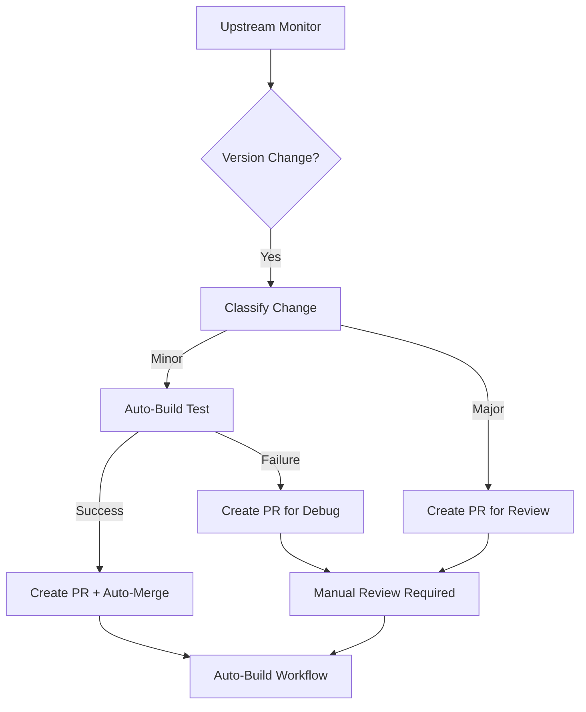

# Docker Container- **Timeline Tracking**: Build history tracked in GitHub Actions and dashboard Repository - AI Agent Instructions

## 🎯 Repository Overview

This is an **automated Docker container management system   4. **Test the Container**:
   ```bash
   chmod +x version.sh
   ./version.sh                       # Should return latest upstream version
   ./version.sh --registry-pattern    # Should return regex pattern for registry matching
   cd ..
   ./make build my-app               # Test build process
   ```intelligent upstream monitoring, version classification, and CI/CD pipelines. The repository maintains multiple containerized applications with sophisticated automation for version detection, building, and deployment.

### Core Architecture
- **📦 Container-Centric**: Each directory represents a self-contained Docker application
- **🔄 Automated Monitoring**: Twice-daily upstream version checks with intelligent PR creation
- **🚀 Hybrid Build System**: PR-centric approach balancing automation speed with safety
- **🛡️ Branch Protection Compatible**: All changes flow through PRs for audit trails
- **📋 Timeline Tracking**: Complete build history in `CHANGELOG.md`

## 🧠 Understanding the Project Structure

### Key Directories & Files
```
docker-containers/
├── .github/
│   ├── workflows/
│   │   ├── upstream-monitor.yaml    # ⭐ Core automation workflow
│   │   ├── auto-build.yaml         # ⭐ Container build & push system
│   │   ├── update-dashboard.yaml   # Dashboard maintenance
│   │   └── validate-version-scripts.yaml
│   ├── actions/                    # Reusable GitHub Actions
│   │   ├── build-container/        # Container build action
│   │   ├── check-upstream-versions/ # Version checking action
│   │   ├── close-duplicate-prs/    # PR management action
│   │   ├── detect-containers/      # Container discovery action
│   │   └── setup-github-cli/       # CLI setup action
│   └── scripts/
│       ├── classify-version-change.sh  # ⭐ Version classification logic
│       └── close-duplicate-prs.sh
├── make                           # ⭐ Universal build script
├── CHANGELOG.md                   # ⭐ Timeline-based build history (tracked in GitHub Actions)
├── [container-name]/             # Individual container directories
│   ├── Dockerfile                # Container definition
│   ├── version.sh               # ⭐ Version detection script
│   ├── docker-compose.yml       # Optional: compose configuration
│   ├── LAST_REBUILD.md          # Rebuild trigger marker (PR-only)
│   └── README.md               # Container documentation
└── helpers/                    # Shared version detection utilities
```

### Critical Components You Must Understand

1. **`make` Script** (Universal Build System)
   - Single entry point for all container operations
   - Handles building, pushing, running, and version checking
   - Integrates with both local development and CI/CD
   - **Usage**: `./make build wordpress`, `./make version ansible`

2. **`version.sh` Scripts** (Version Detection)
   - **Single-purpose**: Always returns latest upstream version (simplified from old two-mode system)
   - **Registry pattern support**: `./version.sh --registry-pattern` returns regex for published versions
   - **Multiple strategies**: Docker Hub API, PyPI integration, GitHub releases
   - **Examples**: 
     - Docker Hub: `latest-docker-tag library/wordpress "^[0-9]+\.[0-9]+\.[0-9]+$"` (wordpress)
     - Docker Hub upstream: `latest-docker-tag hashicorp/terraform "^[0-9]+\.[0-9]+\.[0-9]+$"` (terraform)
     - PyPI integration: `get_pypi_latest_version ansible` (ansible)

3. **Version Classification System** (`.github/scripts/classify-version-change.sh`)
   - Determines **major** vs **minor** version changes
   - Supports multiple versioning schemes: semver, date-based, PHP-style
   - **Major changes**: New containers or major version bumps require manual PR review
   - **Minor changes**: Eligible for auto-build + auto-merge
   - **Special handling**: `no-published-version` treated as major (new container)

## 🔄 The Hybrid Automation Workflow

### PR-Centric Approach Overview
The system uses a sophisticated **PR-centric approach** to balance automation speed with safety:



### Key Automation Flows

1. **Minor/Patch Updates (Fast Path)**:
   - Auto-build test to validate changes
   - If successful: Create PR + enable auto-merge
   - If failed: Create PR for manual debugging
   - **Result**: Fast automation for safe changes

2. **Major Updates (Safe Path)**:
   - Skip auto-build, directly create PR
   - Require manual review and approval
   - **Result**: Human oversight for potentially breaking changes

3. **Branch Protection Compatibility**:
   - ALL changes flow through PRs (no direct pushes)
   - Auto-merge respects branch protection rules
   - Complete audit trail for compliance

## 🛠️ Development Workflows

### Adding a New Container

1. **Create Directory Structure**:
   ```bash
   mkdir my-app
   cd my-app
   ```

2. **Create `Dockerfile`** (follow existing patterns):
   ```dockerfile
   FROM alpine:latest
   # Application setup...
   HEALTHCHECK --interval=30s CMD curl -f http://localhost:8080/health || exit 1
   CMD ["my-app"]
   ```

   3. **Create `version.sh`** (choose appropriate strategy):
   ```bash
   #!/bin/bash
   # Choose one of these patterns:
   
   # Pattern 1: Direct upstream Docker registry lookup
   "$(dirname "$0")/../helpers/latest-docker-tag" owner/image "^[0-9]+\.[0-9]+\.[0-9]+$"
   
   # Pattern 2: PyPI package version lookup  
   source "$(dirname "$0")/../helpers/python-tags"
   if [ "$1" = "--registry-pattern" ]; then
       echo "^[0-9]+\.[0-9]+\.[0-9]+$"
       exit 0
   fi
   get_pypi_latest_version package-name
   
   # Pattern 3: GitHub releases API
   if [ "$1" = "--registry-pattern" ]; then
       echo "^[0-9]+\.[0-9]+\.[0-9]+$"
       exit 0
   fi
   curl -s "https://api.github.com/repos/owner/repo/releases/latest" | \
     jq -r '.tag_name' | sed 's/^v//'
   ```4. **Test the Container**:
   ```bash
   chmod +x version.sh
   ./version.sh          # Should return current version
   ./version.sh latest   # Should return latest upstream
   cd ..
   ./make build my-app   # Test build process
   ```

### Working with Version Scripts

**Critical Patterns to Follow**:

1. **Error Handling**: Always handle API failures gracefully
2. **Timeout**: Use timeouts for network requests
3. **Validation**: Validate version format before returning
4. **Documentation**: Comment the version source clearly

**Helper Utilities Available**:
- `helpers/docker-tags`: Docker Hub API integration
- `helpers/git-tags`: GitHub releases integration  
- `helpers/python-tags`: PyPI package integration
- `helpers/docker-registry`: Shared version detection functions

### Testing and Validation

1. **Version Script Testing**:
   ```bash
   ./validate-version-scripts.sh  # Test all version.sh scripts
   ./test-version-scripts.sh      # Basic validation
   ```

2. **Build Testing**:
   ```bash
   ./make build WANTED=container-name     # Build specific container
   ./make version WANTED=container-name   # Check version
   ```

3. **Workflow Testing**:
   ```bash
   ./test-github-actions.sh  # Validate GitHub Actions syntax
   ```

## 📝 Code Standards & Patterns

### Version Script Patterns
```bash
#!/bin/bash
# Standard header with description

# For make script: registry pattern for published versions
if [ "$1" = "--registry-pattern" ]; then
    echo "^[0-9]+\.[0-9]+\.[0-9]+$"
    exit 0
fi

# Helper function for error handling
get_latest_version() {
    local version
    version=$(curl -s --fail --max-time 30 "https://api.example.com/version" | jq -r '.version' 2>/dev/null)
    if [[ -n "$version" && "$version" != "null" ]]; then
        echo "$version"
    else
        echo "unknown"
        exit 1
    fi
}

# Single-purpose: always return latest upstream version
get_latest_version
```

### Dockerfile Best Practices
- Use specific base image versions when possible
- Include `HEALTHCHECK` instructions
- Follow multi-stage builds for optimization
- Add labels for metadata
- Use non-root users where applicable

### GitHub Actions Patterns
- Always use specific action versions (`uses: actions/checkout@v4`)
- Include proper error handling and continue-on-error where appropriate
- Use step summaries for user-friendly output
- Set proper permissions (contents, packages, pull-requests)

## 🔧 Troubleshooting Guide

### Common Issues & Solutions

1. **Version Script Failures**:
   - Check network connectivity and API rate limits
   - Validate JSON parsing with `jq`
   - Test timeout handling
   - **Debug**: `DEBUG=1 ./container/version.sh latest`

2. **Build Failures**:
   - Check Dockerfile syntax
   - Verify base image availability
   - Review dependency installation steps
   - **Debug**: `./make build container-name` with verbose output

3. **Workflow Issues**:
   - Validate YAML syntax with yamllint
   - Check permissions in workflow files
   - Review action inputs/outputs
   - **Debug**: Enable debug mode in workflow dispatch

4. **PR Creation Problems**:
   - Verify GitHub token permissions
   - Check for existing duplicate PRs
   - Review branch protection settings
   - **Debug**: Manual workflow dispatch with debug enabled

### Log Analysis
- **Build logs**: Available in GitHub Actions workflow runs
- **Test logs**: Stored in `test-logs/` directory
- **Version validation**: Use `validate-version-scripts.sh` output

## 🎯 AI Agent Guidelines

### When Working on This Repository:

1. **Always Test Version Scripts**: After any changes to `version.sh`, run validation
2. **Follow the PR-Centric Approach**: Never bypass the automation system
3. **Understand Version Classification**: Know the difference between major/minor changes
4. **Use the Make Script**: It's the universal interface for all operations
5. **Maintain Documentation**: Update README.md for significant changes

### Key Files to Monitor:
- `make` - Core build system
- `.github/workflows/upstream-monitor.yaml` - Main automation
- `.github/scripts/classify-version-change.sh` - Version logic
- `CHANGELOG.md` - Build history tracking (tracked in GitHub Actions and dashboard)
- Individual `*/version.sh` files - Version detection

### Integration Points:
- **GitHub Actions**: Workflows trigger on schedule and PR events
- **Docker Hub & GHCR**: Multi-registry publishing
- **Branch Protection**: All changes via PRs with optional auto-merge
- **Version Detection**: Multiple strategies for different software types

### Success Criteria:
- Version scripts work reliably with proper error handling
- Containers build successfully with the `make` script
- Automation workflows complete without manual intervention
- Branch protection rules are respected via PR-centric approach

## 💎 Programming Best Practices & Principles

When working on this codebase, follow these fundamental principles:

### **Top 10 Development Guidelines**

1. **KISS (Keep It Simple, Stupid)**: Favor simple, readable solutions over complex ones
2. **SOLID Principles**: Single responsibility, open/closed, Liskov substitution, interface segregation, dependency inversion
3. **DRY (Don't Repeat Yourself)**: Use shared helpers like `helpers/docker-registry` instead of duplicating code
4. **YAGNI (You Aren't Gonna Need It)**: Don't build features you don't currently need
5. **Less Code is Better Code**: Every line of code is a liability - minimize when possible
6. **Fail Fast**: Validate inputs early and provide clear error messages
7. **Single Purpose Functions**: Each script/function should do one thing well
8. **Defensive Programming**: Handle edge cases and network failures gracefully
9. **Consistency Over Cleverness**: Follow existing patterns rather than inventing new ones
10. **Test-Driven Mindset**: Write testable code and validate changes

### **Repository-Specific Rules**

- **No Unnecessary Files**: Don't create config files, wrappers, or abstractions unless they solve a real problem
- **Leverage Existing Patterns**: Use established version script patterns rather than creating new approaches
- **Shared Helpers First**: Check `helpers/` directory before writing duplicate functionality
- **Minimal Dependencies**: Prefer shell built-ins and existing tools over adding new dependencies
- **Direct Solutions**: If a one-liner solves the problem, don't write a function
- **Preserve Working Systems**: This is a production system - don't fix what isn't broken

---

**🎯 Remember**: This is a **production automation system**. Always test changes thoroughly and understand the impact on the automated workflows. The hybrid PR-centric approach ensures both speed and safety - respect this balance when making modifications.
