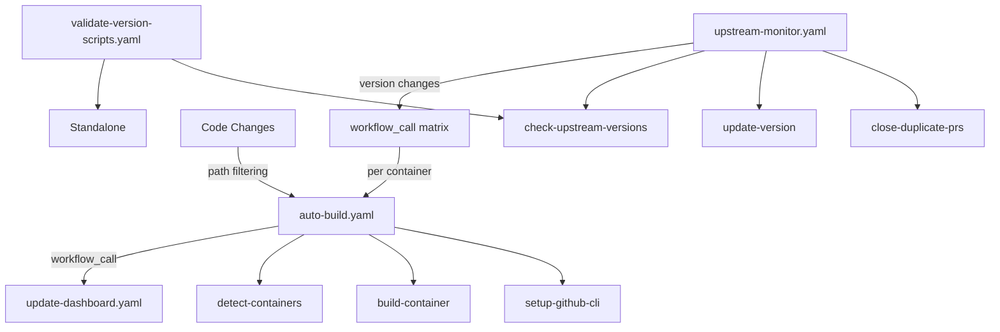

# GitHub Actions Reference

This guide covers the automated workflows and actions used for container management.

## Workflows

### 1. Upstream Monitor (`upstream-monitor.yaml`)

Monitors upstream sources for version updates and creates PRs automatically.

**Triggers:**
- Schedule: 6 AM/6 PM UTC daily
- Manual: `gh workflow run upstream-monitor.yaml`

**Key Inputs:**
```bash
# Check specific container with debug
gh workflow run upstream-monitor.yaml \
  --field container=wordpress \
  --field debug=true \
  --field create_pr=true
```

## Architecture Overview

Our GitHub Actions system uses a **hybrid approach** combining direct workflow calls for upstream changes with GitHub's native path filtering for code changes:



**Key Principles:**
- **Hybrid Triggers**: Direct workflow_call for upstream changes, path filtering for code changes
- **Matrix Strategy**: upstream-monitor calls auto-build once per updated container
- **Clean Separation**: Each workflow has distinct, focused responsibilities
- **Force Rebuild**: Upstream changes use force_rebuild to ensure containers are updated

## Workflows

### 1. Upstream Monitor (`upstream-monitor.yaml`) - Primary Entry Point

The **core orchestrator** that monitors upstream sources and initiates the entire automation pipeline.

**Triggers:**
- **Schedule**: 6 AM/6 PM UTC daily (ONLY workflow with schedule)
- **Manual**: `gh workflow run upstream-monitor.yaml`

**Responsibilities:**
- Monitor upstream software versions
- Create PRs for version updates  
- **Trigger auto-build directly for upstream changes** (using matrix strategy)
- Manage duplicate PR cleanup

**Key Inputs:**
```bash
# Check specific container with debug
gh workflow run upstream-monitor.yaml 
  --field container=wordpress 
  --field debug=true 
  --field create_pr=true
```

**Workflow Chain:**
1. Checks upstream versions using `check-upstream-versions` action
2. Updates versions using `update-version` action
3. Closes duplicate PRs using `close-duplicate-prs` action
4. **Triggers auto-build using matrix strategy** (one call per container)

### 2. Auto Build (`auto-build.yaml`) - Build Orchestrator

Builds and pushes containers when triggered by upstream monitor or code changes.

**Triggers:**
- **workflow_call with matrix**: From upstream-monitor (one call per updated container)
- **Push/PR Events**: GitHub's native path filtering for container file changes
- **Manual**: `gh workflow run auto-build.yaml`

**Responsibilities:**
- Build specific containers (from upstream changes or code changes)
- Push containers to registries
- Trigger dashboard updates

**Features:**
- Multi-architecture builds (amd64, arm64)
- **Hybrid detection**: Matrix for upstream changes, path filtering for code changes
- Registry push automation via `build-container` action
- Automatic dashboard updates

**Usage:**
```bash
# Build all containers manually
gh workflow run auto-build.yaml

# Force rebuild specific container  
gh workflow run auto-build.yaml 
  --field container=wordpress 
  --field force_rebuild=true
```

**Workflow Chain:**
1. Detects containers using `detect-containers` action
2. Builds containers using `build-container` action
3. **Triggers** `update-dashboard.yaml` via `workflow_call`

### 3. Update Dashboard (`update-dashboard.yaml`) - Documentation Sync

Updates the repository dashboard and GitHub Pages after successful builds.

**Triggers:**
- **workflow_call**: From `auto-build.yaml` (primary trigger)
- **Manual**: For dashboard-only updates

**Responsibilities:**
- Generate container status dashboard
- Deploy updates to GitHub Pages
- Maintain build history

### 4. Version Validation (`validate-version-scripts.yaml`) - Quality Assurance

Validates all version.sh scripts for functionality and standards compliance.

**Triggers:**
- **Push/PR**: Changes to version.sh files
- **Manual**: For testing and validation

**Local Testing:**
```bash
./validate-version-scripts.sh
```
```

**Outputs:**
- Container update summary
- Pull requests for version updates
- Automatic build triggers

### 2. Auto Build (`auto-build.yaml`)

Builds and pushes containers when changes are detected.

**Triggers:**
- Push to main/master (affecting container files)
- Pull requests
- Schedule (twice daily)
- Manual dispatch

**Features:**
- Multi-architecture builds (amd64, arm64)
- Smart change detection
- Registry push automation
- Build retry logic

**Usage:**
```bash
# Build all containers
gh workflow run auto-build.yaml

# Force rebuild specific container  
gh workflow run auto-build.yaml \
  --field container=wordpress \
  --field force_rebuild=true
```

### 3. Version Validation (`validate-version-scripts.yaml`)

Validates all version.sh scripts for functionality and standards compliance.

**Triggers:**
- Changes to version.sh files
- Manual dispatch

**Local Testing:**
```bash
./validate-version-scripts.sh
```

## Dependency Matrix

### Workflow → Action Dependencies

| Workflow | Actions Used | Usage Count | Trigger Type |
|----------|-------------|-------------|--------------|
| `upstream-monitor.yaml` | `check-upstream-versions`<br>`update-version`<br>`close-duplicate-prs` | 3 actions | **Schedule** (6 AM/6 PM UTC)<br>Manual dispatch |
| `auto-build.yaml` | `detect-containers`<br>`build-container`<br>`setup-github-cli` | 3 actions | **workflow_call** (from upstream-monitor)<br>Push/PR events<br>Manual dispatch |
| `update-dashboard.yaml` | None (uses scripts directly) | 0 actions | **workflow_call** (from auto-build)<br>Manual dispatch |
| `validate-version-scripts.yaml` | `check-upstream-versions` | 1 action | Push/PR events<br>Manual dispatch |

### Workflow → Workflow Dependencies

| Source Workflow | Triggers | Target Workflow | Method |
|-----------------|----------|-----------------|---------|
| `upstream-monitor.yaml` | → | `auto-build.yaml` | `workflow_call` |
| `auto-build.yaml` | → | `update-dashboard.yaml` | `workflow_call` |

### Action Usage Analysis

| Action | Used By | Total Usage | Purpose |
|--------|---------|-------------|---------|
| `check-upstream-versions` | `upstream-monitor.yaml`<br>`validate-version-scripts.yaml` | **2x** | Version detection and validation |
| `build-container` | `auto-build.yaml` | **1x** | Container building and pushing |
| `detect-containers` | `auto-build.yaml` | **1x** | Smart container change detection |
| `close-duplicate-prs` | `upstream-monitor.yaml` | **1x** | PR management and cleanup |
| `update-version` | `upstream-monitor.yaml` | **1x** | Version file updates |
| `setup-github-cli` | `auto-build.yaml` | **1x** | GitHub CLI configuration |

**Status: ✅ All 6 actions are actively used across workflows**

## Reusable Actions

### Check Upstream Versions (`.github/actions/check-upstream-versions`)

**Used by:** `upstream-monitor.yaml`, `validate-version-scripts.yaml`

Checks for upstream version updates across containers using individual `version.sh` scripts.

**Inputs:**
- `container` (optional): Specific container to check

**Outputs:**
- `containers_with_updates`: JSON array of containers needing updates
- `update_count`: Number of containers with updates
- `version_info`: Detailed version information

**Key Features:**
- Supports both single container and bulk checking
- Integrates with shared helper functions
- Handles version script failures gracefully

### Build Container (`.github/actions/build-container`)

**Used by:** `auto-build.yaml`

Builds a specific container using the universal `make` script with enhanced error handling.

**Inputs:**
- `container`: Container name to build
- `force_rebuild`: Force rebuild even if up-to-date
- `dockerhub_username`, `dockerhub_token`, `github_token`: Registry credentials

**Key Features:**
- Delegates to universal `make` script with `--bare` mode
- Multi-registry support (Docker Hub + GHCR)
- Proper exit code handling
- Build status reporting

### Detect Containers (`.github/actions/detect-containers`)

**Used by:** `auto-build.yaml`

Intelligently detects which containers need building based on file changes.

**Outputs:**
- `containers`: JSON array of containers to build
- `count`: Number of containers detected

**Logic:**
- Analyzes git changes for container-specific files
- Supports forced rebuilds via input parameters
- Excludes non-container directories

### Close Duplicate PRs (`.github/actions/close-duplicate-prs`)

**Used by:** `upstream-monitor.yaml`

Manages PR lifecycle by closing outdated or duplicate version update PRs.

**Features:**
- Prevents PR spam from multiple automation runs
- Maintains clean PR history
- Respects manual PRs and other automation

### Update Version (`.github/actions/update-version`)

**Used by:** `upstream-monitor.yaml`

Updates container version files and creates commit for PR creation.

**Features:**
- Updates version.sh or metadata files
- Creates descriptive commit messages
- Integrates with PR creation workflow

### Setup GitHub CLI (`.github/actions/setup-github-cli`)

**Used by:** `auto-build.yaml`

Configures GitHub CLI for workflow operations.

**Features:**
- Installs and configures `gh` CLI
- Sets up authentication tokens
- Provides consistent CLI environment

### Check Upstream Versions (`.github/actions/check-upstream-versions`)

Checks for upstream version updates across containers.

**Inputs:**
- `container` (optional): Specific container to check

**Outputs:**
- `containers_with_updates`: JSON array of containers needing updates
- `update_count`: Number of containers with updates
- `version_info`: Detailed version information

### Build Container (`.github/actions/build-container`)

Builds a specific container with optimizations and error handling.

**Inputs:**
- `container`: Container name to build
- `force_rebuild`: Force rebuild even if up-to-date
- `dockerhub_username`, `dockerhub_token`, `github_token`: Registry credentials

**Features:**
- Multi-architecture support
- Build caching
- Registry push automation
- Retry logic on failures

### Detect Containers (`.github/actions/detect-containers`)

Intelligently detects which containers need building based on changes.

**Outputs:**
- `containers`: JSON array of containers to build
- `count`: Number of containers detected

## Usage Examples

### Manual Workflow Triggers

```bash
# PRIMARY: Monitor all containers for updates (triggers full pipeline)
gh workflow run upstream-monitor.yaml

# Check specific container with debug output
gh workflow run upstream-monitor.yaml \
  --field container=ansible \
  --field debug=true \
  --field create_pr=false

# SECONDARY: Force rebuild all containers (manual builds only)
gh workflow run auto-build.yaml \
  --field force_rebuild=true

# Build specific container manually
gh workflow run auto-build.yaml \
  --field container=wordpress \
  --field force_rebuild=true

# UTILITY: Update dashboard only
gh workflow run update-dashboard.yaml

# TESTING: Validate version scripts
gh workflow run validate-version-scripts.yaml
```

### Workflow Integration Pattern

Our optimized architecture follows this pattern for reliable automation:

```yaml
# upstream-monitor.yaml (Primary Entry Point)
name: Upstream Monitor
on:
  schedule:
    - cron: '0 6,18 * * *'  # Only workflow with schedule
  workflow_dispatch:
    inputs:
      container: { type: string }
      debug: { type: boolean, default: false }
      create_pr: { type: boolean, default: true }

jobs:
  # ... version checking jobs ...
  
  trigger-builds:
    if: success() && steps.check.outputs.update_count > 0
    uses: ./.github/workflows/auto-build.yaml  # workflow_call trigger
    with:
      container: ${{ inputs.container }}
    secrets: inherit

---

# auto-build.yaml (Secondary - Triggered by Primary)
name: Auto Build
on:
  workflow_call:    # PRIMARY trigger from upstream-monitor
    inputs:
      container: { type: string }
  push:            # SECONDARY trigger for code changes
    paths: ['*/Dockerfile', '*/version.sh']
  workflow_dispatch: # MANUAL trigger

jobs:
  # ... build jobs ...
  
  update-dashboard:
    if: success()
    uses: ./.github/workflows/update-dashboard.yaml  # workflow_call trigger
    secrets: inherit
```

### Using Actions in Custom Workflows

```yaml
name: Custom Container Workflow
on: workflow_dispatch

jobs:
  check-and-build:
    runs-on: ubuntu-latest
    steps:
      - uses: actions/checkout@v4
      
      - name: Check for updates
        id: check
        uses: ./.github/actions/check-upstream-versions
        with:
          container: wordpress
      
      - name: Build if updated
        if: steps.check.outputs.update_count > 0
        uses: ./.github/actions/build-container
        with:
          container: wordpress
          force_rebuild: false
          github_token: ${{ secrets.GITHUB_TOKEN }}
```

## Required Permissions

Workflows require specific GitHub token permissions based on their responsibilities:

### Upstream Monitor Workflow
```yaml
permissions:
  contents: write      # Update version files and create commits
  pull-requests: write # Create and manage version update PRs
  actions: write       # Trigger auto-build workflow via workflow_call
```

### Auto Build Workflow  
```yaml
permissions:
  contents: read       # Read repository files for building
  packages: write      # Push to GHCR (ghcr.io registry)
  actions: write       # Trigger update-dashboard workflow via workflow_call
```

### Update Dashboard Workflow
```yaml
permissions:
  contents: write      # Update dashboard files and commit to gh-pages
  pages: write         # Deploy to GitHub Pages
```

### Registry Credentials
```yaml
# Via GitHub Secrets (for Docker Hub):
secrets:
  DOCKERHUB_USERNAME: ${{ secrets.DOCKERHUB_USERNAME }}
  DOCKERHUB_TOKEN: ${{ secrets.DOCKERHUB_TOKEN }}
  
# GitHub Container Registry uses GITHUB_TOKEN automatically
```

## Environment Configuration

### Global Workflow Environment

```yaml
env:
  # Build Optimization
  DOCKER_BUILDKIT: 1                    # Enable BuildKit for faster builds
  BUILDX_NO_DEFAULT_ATTESTATIONS: 1     # Disable attestations for speed
  
  # Automation Limits
  MAX_OPEN_PRS_PER_CONTAINER: 2         # Limit concurrent PRs per container
  PR_AUTO_CLOSE_DAYS: 7                 # Auto-close stale PRs after 7 days
  
  # Registry Configuration  
  REGISTRY_URL: ghcr.io                 # Primary registry (GHCR)
  DOCKERHUB_REGISTRY: docker.io         # Secondary registry (Docker Hub)
```

### Container-Specific Environment

```yaml
# Set in Dockerfiles with flexible version handling
ARG VERSION=latest                      # Default to latest, override in builds
ENV CONTAINER_VERSION=${VERSION}        # Runtime version visibility
```

## Troubleshooting

### Workflow Architecture Issues

**Scheduling Conflicts (RESOLVED):**
- ✅ **Fixed**: Only `upstream-monitor.yaml` has schedule triggers
- ✅ **Fixed**: `auto-build.yaml` uses `workflow_call` instead of schedule
- ✅ **Fixed**: Clean trigger chain eliminates race conditions

**Workflow Not Triggering:**
- Check if `upstream-monitor.yaml` is the entry point (it should be)
- Verify `workflow_call` triggers are properly configured
- Ensure branch protection rules allow workflow_call
- Validate GitHub token permissions for cross-workflow triggers

### Version Script Failures

**Local Testing:**
```bash
# Test version script directly
cd container-name
./version.sh          # Check current version  
./version.sh latest   # Check upstream version

# Test with debug output
DEBUG=1 ./version.sh latest
```

**Common Issues:**
- API rate limits (use authenticated requests where possible)
- Network timeouts (check API response times)
- JSON parsing errors (validate with `jq` locally)
- Invalid version formats (check regex patterns)

### Build Failures

**Debug Build Process:**
```bash
# Test build locally using make script
./make build container-name

# Enable verbose output
DEBUG=1 ./make build container-name

# Test specific architecture
./make build container-name --platform linux/amd64
```

**Common Issues:**
- Docker daemon connectivity
- Registry authentication (check DOCKERHUB_TOKEN)
- Build context size (optimize .dockerignore)
- Multi-architecture compatibility

### Action Integration Issues

**Action Path Resolution:**
- All actions use relative paths: `uses: ./.github/actions/action-name`
- Verify action directories exist and contain `action.yml`
- Check action inputs/outputs match workflow usage

**Workflow Call Issues:**
```yaml
# Correct workflow_call syntax:
uses: ./.github/workflows/target-workflow.yaml
with:
  input_name: value
secrets: inherit  # Required for cross-workflow secrets
```

## Performance Optimization

### Workflow Hierarchy Benefits

**Before Optimization:**
- Multiple workflows with overlapping schedules
- Race conditions between concurrent runs
- Redundant container detection logic

**After Optimization:**
- Single scheduled entry point (`upstream-monitor`)
- Sequential workflow execution via `workflow_call`
- Shared container detection and build logic
- Reduced GitHub Actions minutes usage

### Build Performance

**Multi-Architecture Strategy:**
```yaml
# Optimized build matrix
strategy:
  matrix:
    platform: 
      - linux/amd64
      - linux/arm64
  fail-fast: false  # Continue building other architectures on failure
```

**Build Caching:**
```dockerfile
# Leverage BuildKit cache mounts
RUN --mount=type=cache,target=/var/cache/apt \
    apt-get update && apt-get install -y package
```

## Best Practices

### Workflow Design Principles

1. **Single Source of Truth**: One workflow triggers the automation chain
2. **Proper Separation**: Each workflow has distinct responsibilities  
3. **Fail-Safe Operation**: Workflows continue on non-critical errors
4. **Comprehensive Logging**: All steps include descriptive names and summaries

### Action Development

1. **Reusability**: Actions should work across multiple workflows
2. **Error Handling**: Graceful failure with descriptive error messages
3. **Input Validation**: Validate all inputs before processing
4. **Output Consistency**: Standardized output formats (JSON for complex data)

### Security & Maintenance

1. **Minimal Permissions**: Use least-privilege principle for workflow permissions
2. **Secret Management**: Store credentials in GitHub Secrets, never in code
3. **Version Pinning**: Use specific action versions (e.g., `@v4`) not `@latest`
4. **Regular Audits**: Review workflow logs and update patterns quarterly

---

**Last Updated**: June 2025  
**Architecture Version**: Optimized Hierarchical (Single Entry Point)
